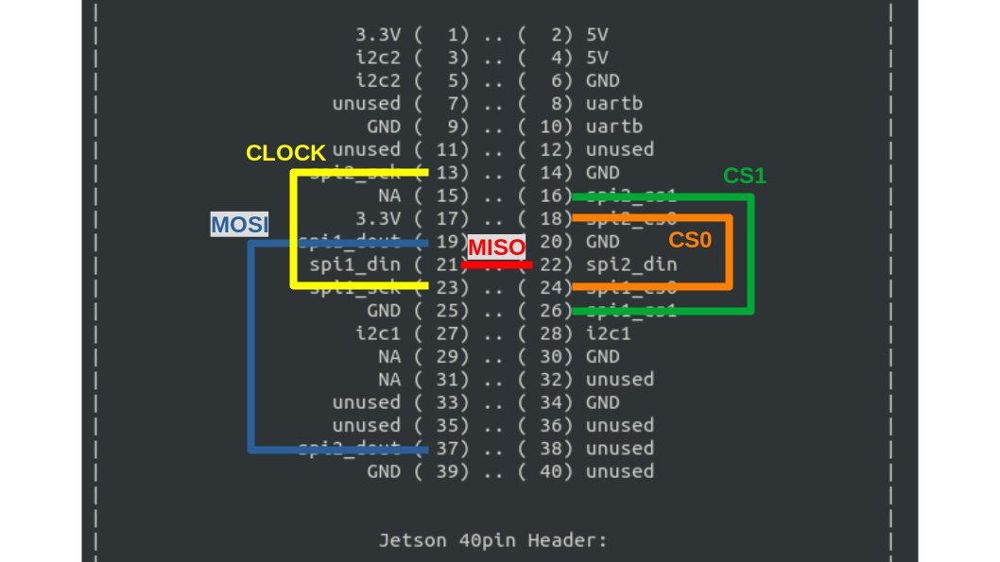
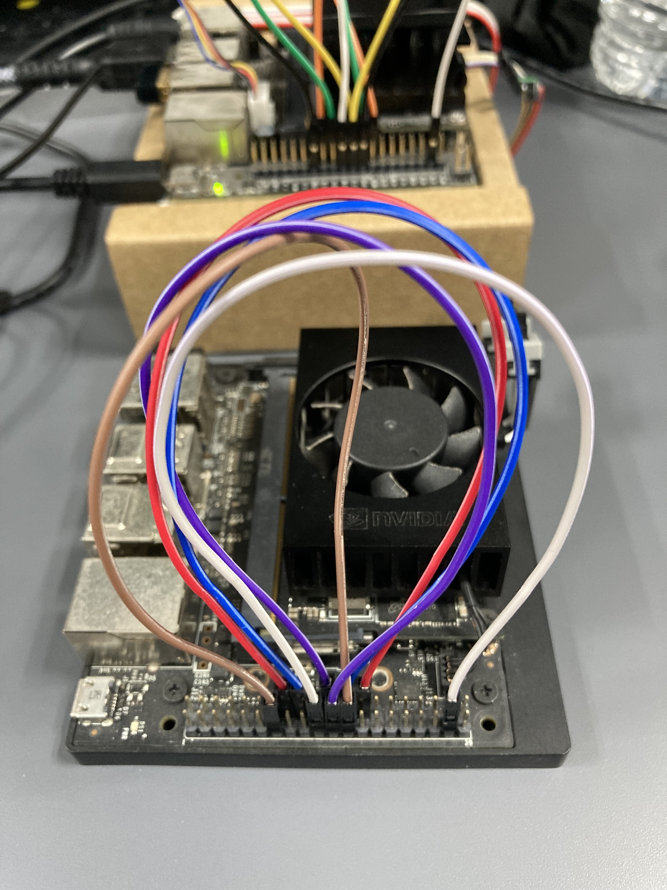
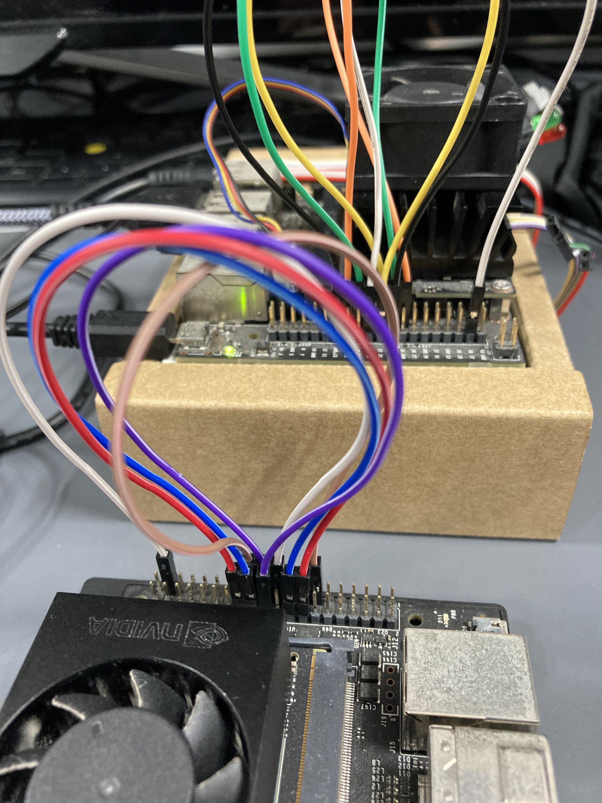

# Jetson Developer Kit (JetPack 4.6.3)で SPI通信を有効にする方法
ここでは Jetson Nano Developer Kit と Jetson Xavier NX Developer Kit を対象とする。
**JetPack 4.6.3** の前提であるが、**JetPack 4.6.2** でも同様。
もし、Jetson Nano Developer Kit を使うなら **JetPack 4.6.2** の方が設定が楽。

基本的には
[Jetsion-IO](https://docs.nvidia.com/jetson/archives/l4t-archived/l4t-3261/index.html#page/Tegra%20Linux%20Driver%20Package%20Development%20Guide/hw_setup_jetson_io.html#)
を使って Developer Kit のキャリアボードにある拡張 40pin ヘッダーの設定を
GPIO から SPI に変更してから、
カーネルモジュール **spidev** をロードすると SPI(Master) として使えるようになる。

次の場合には追加で設定が必要
* SPI(Slave) として使う
* Jetson Nano Debeloper Kit (w/ JetPack 4.6.3) で使う

## Jetson-IO
コマンドラインで下記を実行。
拡張 40pin ヘッダの設定時、縦長に表示されるのでウィンドウの大きさを目一杯拡げておくのがオススメ。

```bash
sudo /opt/nvidia/jetson-io/jetson-io.py
```

以下のようなメニュー操作を行う。

	[ Configure Jetson 40pin Header ]
		[ Configure header pins manually ]
			[ spi1 と spi2(又は spi3) に '*' 印を付ける ]
		[ Save pin changes ]
			[ Save and reboot to reconfigure pins ]

再起動をじっと待つ。

この一連の作業で DTB(Device Tree Blob) ファイルが作られ、起動時に読み込むように設定される。

```bash
cat /boot/extlinux/extlinux.conf

# FDT /boot/kernel_tegraほげほげ-user-custom.dtb が追記されているのを確認出来る。
```

## カーネルモジュール **spidev**
下記のいずれかの方法で **spidev** をロードする。

1. `modprobe` コマンドを使う
```bash
sudo modprobe spidev
```

2. ***/etc/modules-load.d/modules.conf*** に追加する  
起動時に読み込まれるようになる
```bash
# /etc/modules: kernel modules to load at boot time.
#
# This file contains the names of kernel modules that should be loaded
# at boot time, one per line. Lines beginning with "#" are ignored.

spidev
```
```bash
# 追加後にリブート
sudo reboot
```

ここまでの作業で SPI(Master) として使えるようになっている。
ただし、Jetson Nano Developer Kit(w/ JetPack 4.6.3) の場合を除く。

## SPI(Master) の動作テスト
**spi1** の場合、
拡張 40pin ヘッダーの pin#19(MOSI) と pin#21(MISO) をジャンパーでつなぐ。  
**spi2、spi3** の場合、
拡張 40pin ヘッダーの pin#37(MOSI) と pin#22(MISO) をジャンパーでつなぐ。  
いずれの場合もクロック(SCK)、チップセレクト(CS0, CS1)はつながなくて良い。

* MOSI : Master Out Slave In (Master 時にはデータ出力、Slave 時にはデータ入力)
* MISO : Master In Slave Out (Master 時にはデータ入力、Slave 時にはデータ出力)

動作テストには `spidev_test` を使う。
[これ](https://github.com/torvalds/linux/blob/master/tools/spi/spidev_test.c)が公式なやつ。

[この Web ページ](https://qiita.com/kan573/items/b362b6b9fc493ee2223f)を参考。  
ビルド時に #define が足りないので、
***/usr/include/linux/spi/spidev.h*** に追加する。
```C
#define SPI_TX_OCTAL            0x2000  // 追加 1
#define SPI_RX_OCTAL            0x4000  // 追加 2
```

ビルド、
```bash
gcc -o spidev_test spidev_test.c
```

テスト実行
```bash
# spi1 の場合
./spidev_test -D /dev/spidev0.0 -v

# spi mode: 0x0
# bits per word: 8
# max speed: 500000 Hz (500 kHz)
# TX | FF FF FF FF FF FF 40 00 00 00 00 95 FF FF FF FF FF FF FF FF FF FF FF FF FF FF FF FF FF FF F0 0D  |......@.........................|
# RX | FF FF FF FF FF FF 40 00 00 00 00 95 FF FF FF FF FF FF FF FF FF FF FF FF FF FF FF FF FF FF F0 0D  |......@.........................|
# TX と RX が同じになれば OK

# spi2 の場合
./spidev_test -D /dev/spidev1.0 -v

# spi3 の場合
./spidev_test -D /dev/spidev2.0 -v
```

## SPI(Slave) の設定
SPI(Slave) として使うためには DTB ファイルの設定を更新する。

\*.dtb ファイルはバイナリ形式なので、一旦テキスト形式(\*.dts) に変換して設定を変更する。
変更後、バイナリ形式(\*.dtb)に戻す。

### DTB ファイルのバイナリ形式 <---> テキスト形式変換
```bash
# Jetson Nano Developer Kit の例

# *.dtb --> *.dts. バイナリ形式 → テキスト形式
dtc -I dtb -O dts -o ./extracted.dts /boot/kernel_tegra210-p3448-0000-p3449-0000-b00-user-custom.dtb

# *.dts --> *.dtb. テキスト形式 → バイナリ形式
sudo dtc -I dts -O dtb -o /boot/kernel_tegra210-p3448-0000-p3449-0000-b00-user-custom.dtb ./extracted.dts
```

### 変更点(Jetson Nano Developer Kit の場合)
拡張 40pin ヘッダーには **spi1** と **spi2** が出ているので、
Slave に変更したい **spi** の方の設定を下記のように変更する。
もちろん、両方変更しても良い。
* compatible = "nvidia,tegra210-spi";
を
* compatible = **"nvidia,tegra210-spi-slave"**;
に変える

```bash
# spi2 の場合
# *.dts ファイルで hdr40_spi を検索するとアドレスが分かる。
        spi@7000d600 {
                compatible = "nvidia,tegra210-spi-slave";
```

### 変更点(Jetson Xavier NX Developer Kit の場合)
拡張 40pin ヘッダーには **spi1** と **spi3** が出ているので、
Slave に変更したい **spi** の方の設定を下記のように変更する。
もちろん、両方変更しても良い。
* compatible = "nvidia,tegra194-spi";
を
* compatible = **"nvidia,tegra194-spi-slave"**;
に変える

```bash
# spi3 の場合
# *.dts ファイルで hdr40_spi を検索するとアドレスが分かる。
        spi@3230000 {
                compatible = "nvidia,tegra194-spi-slave";
```

### SPI(Slave) の動作テスト
Jetson Nano Developer Kit なら、 **spi1** と **spi2** を
Jetson Xavier NX Developer Kit なら、 **spi1** と **spi3** を
ジャンパー線で接続する。

* 結線図(Jetson Nano, Jetson Xavier NX 共通)



動作テストには `spidev_test` (SPI(Master)の動作テストとは別物)を使う。  
[これ](https://forums.developer.nvidia.com/t/how-to-set-to-spi-slave-mode/155310/5)。
ダウンロードするとファイル名が ***spidev_test.txt*** になっているので
***spidev_test*** にリネームして実行属性を付ける(`chmod +x`)。

Jetson Nano Developer Kit の場合、
**spi1** を **Master**、 **spi2** を **Slave** とすれば、
下記のように実行する。
Jetson Xavier NX Developer Kit の場合は **spi2** ではなく **spi3** を使う。
デバイス名の指定は ***/dev/spidev1.0*** ではなく ***/dev/spidev2.0*** にする。

ターミナルを 2つ開き、
```bash
# ターミナル 1 (Slave)
sudo ./spidev_test -D /dev/spidev1.0 -s16500000 -g512 -b32 -H -p0 -n1 -r -zzz
```
で受信待ち。
```bash
# ターミナル 2 (Master)
sudo ./spidev_test -D /dev/spidev0.0 -s16500000 -g512 -b32 -H -p0 -n1 -zzz -t
```
で送信。

実行結果は、
```
# ターミナル 1 (Slave)
using device: /dev/spidev1.0
setting spi mode for read,write
setting spi bpw
setting max speed for rd/wr
spi mode: 1
bits per word: 32 bytes per word: 4
max speed: 16500000 Hz (16500 KHz)
no. runs: 1
Using seed:0x63db4fae
loop count = 0 
transfer: Return actual transfer length: 512
receive bytes [512]
0000: 00 01 02 03 04 05 06 07 08 09 0A 0B 0C 0D 0E 0F 
0010: 10 11 12 13 14 15 16 17 18 19 1A 1B 1C 1D 1E 1F 
0020: 20 21 22 23 24 25 26 27 28 29 2A 2B 2C 2D 2E 2F 
0030: 30 31 32 33 34 35 36 37 38 39 3A 3B 3C 3D 3E 3F 
0040: 40 41 42 43 44 45 46 47 48 49 4A 4B 4C 4D 4E 4F 
0050: 50 51 52 53 54 55 56 57 58 59 5A 5B 5C 5D 5E 5F 
0060: 60 61 62 63 64 65 66 67 68 69 6A 6B 6C 6D 6E 6F 
0070: 70 71 72 73 74 75 76 77 78 79 7A 7B 7C 7D 7E 7F 
0080: 80 81 82 83 84 85 86 87 88 89 8A 8B 8C 8D 8E 8F 
0090: 90 91 92 93 94 95 96 97 98 99 9A 9B 9C 9D 9E 9F 
00A0: A0 A1 A2 A3 A4 A5 A6 A7 A8 A9 AA AB AC AD AE AF 
00B0: B0 B1 B2 B3 B4 B5 B6 B7 B8 B9 BA BB BC BD BE BF 
00C0: C0 C1 C2 C3 C4 C5 C6 C7 C8 C9 CA CB CC CD CE CF 
00D0: D0 D1 D2 D3 D4 D5 D6 D7 D8 D9 DA DB DC DD DE DF 
00E0: E0 E1 E2 E3 E4 E5 E6 E7 E8 E9 EA EB EC ED EE EF 
00F0: F0 F1 F2 F3 F4 F5 F6 F7 F8 F9 FA FB FC FD FE 00 
0100: 01 02 03 04 05 06 07 08 09 0A 0B 0C 0D 0E 0F 10 
0110: 11 12 13 14 15 16 17 18 19 1A 1B 1C 1D 1E 1F 20 
0120: 21 22 23 24 25 26 27 28 29 2A 2B 2C 2D 2E 2F 30 
0130: 31 32 33 34 35 36 37 38 39 3A 3B 3C 3D 3E 3F 40 
0140: 41 42 43 44 45 46 47 48 49 4A 4B 4C 4D 4E 4F 50 
0150: 51 52 53 54 55 56 57 58 59 5A 5B 5C 5D 5E 5F 60 
0160: 61 62 63 64 65 66 67 68 69 6A 6B 6C 6D 6E 6F 70 
0170: 71 72 73 74 75 76 77 78 79 7A 7B 7C 7D 7E 7F 80 
0180: 81 82 83 84 85 86 87 88 89 8A 8B 8C 8D 8E 8F 90 
0190: 91 92 93 94 95 96 97 98 99 9A 9B 9C 9D 9E 9F A0 
01A0: A1 A2 A3 A4 A5 A6 A7 A8 A9 AA AB AC AD AE AF B0 
01B0: B1 B2 B3 B4 B5 B6 B7 B8 B9 BA BB BC BD BE BF C0 
01C0: C1 C2 C3 C4 C5 C6 C7 C8 C9 CA CB CC CD CE CF D0 
01D0: D1 D2 D3 D4 D5 D6 D7 D8 D9 DA DB DC DD DE DF E0 
01E0: E1 E2 E3 E4 E5 E6 E7 E8 E9 EA EB EC ED EE EF F0 
01F0: F1 F2 F3 F4 F5 F6 F7 F8 F9 FA FB FC FD FE 00 01 
transfer: received packet size:512 len:512 stat:0
/dev/spidev1.0: TEST PASSED 
====== Transfer stats ====
Receive:
       total: 512B (0KiB 0MiB)
       total: 1P 
        good: 512B (0KiB 0MiB)
        good: 1P
       ioerr: 0P
     dataerr: 0P
 Rate:
        good: 51B/s (0KB/s)
        good: 0P/s
 packet drop: -1/10000

  Total time: 10.023272s
```

```
# ターミナル 2 (Master)
Disabling receive
using device: /dev/spidev0.0
setting spi mode for read,write
setting spi bpw
setting max speed for rd/wr
spi mode: 1
bits per word: 32 bytes per word: 4
max speed: 16500000 Hz (16500 KHz)
no. runs: 1
Using seed:0x63db4fb8
loop count = 0 
using sequential pattern ....
transfer bytes [512]
0000: 00 01 02 03 04 05 06 07 08 09 0A 0B 0C 0D 0E 0F 
0010: 10 11 12 13 14 15 16 17 18 19 1A 1B 1C 1D 1E 1F 
0020: 20 21 22 23 24 25 26 27 28 29 2A 2B 2C 2D 2E 2F 
0030: 30 31 32 33 34 35 36 37 38 39 3A 3B 3C 3D 3E 3F 
0040: 40 41 42 43 44 45 46 47 48 49 4A 4B 4C 4D 4E 4F 
0050: 50 51 52 53 54 55 56 57 58 59 5A 5B 5C 5D 5E 5F 
0060: 60 61 62 63 64 65 66 67 68 69 6A 6B 6C 6D 6E 6F 
0070: 70 71 72 73 74 75 76 77 78 79 7A 7B 7C 7D 7E 7F 
0080: 80 81 82 83 84 85 86 87 88 89 8A 8B 8C 8D 8E 8F 
0090: 90 91 92 93 94 95 96 97 98 99 9A 9B 9C 9D 9E 9F 
00A0: A0 A1 A2 A3 A4 A5 A6 A7 A8 A9 AA AB AC AD AE AF 
00B0: B0 B1 B2 B3 B4 B5 B6 B7 B8 B9 BA BB BC BD BE BF 
00C0: C0 C1 C2 C3 C4 C5 C6 C7 C8 C9 CA CB CC CD CE CF 
00D0: D0 D1 D2 D3 D4 D5 D6 D7 D8 D9 DA DB DC DD DE DF 
00E0: E0 E1 E2 E3 E4 E5 E6 E7 E8 E9 EA EB EC ED EE EF 
00F0: F0 F1 F2 F3 F4 F5 F6 F7 F8 F9 FA FB FC FD FE 00 
0100: 01 02 03 04 05 06 07 08 09 0A 0B 0C 0D 0E 0F 10 
0110: 11 12 13 14 15 16 17 18 19 1A 1B 1C 1D 1E 1F 20 
0120: 21 22 23 24 25 26 27 28 29 2A 2B 2C 2D 2E 2F 30 
0130: 31 32 33 34 35 36 37 38 39 3A 3B 3C 3D 3E 3F 40 
0140: 41 42 43 44 45 46 47 48 49 4A 4B 4C 4D 4E 4F 50 
0150: 51 52 53 54 55 56 57 58 59 5A 5B 5C 5D 5E 5F 60 
0160: 61 62 63 64 65 66 67 68 69 6A 6B 6C 6D 6E 6F 70 
0170: 71 72 73 74 75 76 77 78 79 7A 7B 7C 7D 7E 7F 80 
0180: 81 82 83 84 85 86 87 88 89 8A 8B 8C 8D 8E 8F 90 
0190: 91 92 93 94 95 96 97 98 99 9A 9B 9C 9D 9E 9F A0 
01A0: A1 A2 A3 A4 A5 A6 A7 A8 A9 AA AB AC AD AE AF B0 
01B0: B1 B2 B3 B4 B5 B6 B7 B8 B9 BA BB BC BD BE BF C0 
01C0: C1 C2 C3 C4 C5 C6 C7 C8 C9 CA CB CC CD CE CF D0 
01D0: D1 D2 D3 D4 D5 D6 D7 D8 D9 DA DB DC DD DE DF E0 
01E0: E1 E2 E3 E4 E5 E6 E7 E8 E9 EA EB EC ED EE EF F0 
01F0: F1 F2 F3 F4 F5 F6 F7 F8 F9 FA FB FC FD FE 00 01 
/dev/spidev0.0: TEST PASSED 
====== Transfer stats ====
Transmit:
       total: 512B (0KiB 0MiB)
       total: 1P 
       ioerr: 0B (0KiB 0MiB)
       ioerr: 0P
 Rate:
  wire total: -1B/s (0KB/s)
       total: -1B/s (0KB/s)
  wire total: -1P/s
       total: -1P/s

  Total time: 0.001021s
```

## Jetson Nano Debeloper Kit (w/ JetPack 4.6.3) で使う時には
Jetson-IO の設定が有効にならない現象が発生する。困ったものだ。
原因はブートローダーにあるようで、 **JetPack 4.6.2** のブートローダーに書き換えれば SPI が拡張 40pin ヘッダーで有効になる。

### JetPack 4.6.2 のブートローダー書き込み環境をゲットする
[ここ](https://developer.nvidia.com/embedded/l4t/r32_release_v7.2/t210/jetson-210_linux_r32.7.2_aarch64.tbz2)
から **L4T Driver Package (BSP)** をダウンロードする。ファイル名は ***Jetson-210_Linux_R32.7.2_aarch64.tbz2*** 。

これを展開してブートローダーを書き込む。
```bash
tar xvf Jetson-210_Linux_R32.7.2_aarch64.tbz2
cd Linux_for_Tegra

# ここで Jetson Nano Developer Kit をリカバリモードで起動する。

# 起動確認は、
lsusb
# NVIDIA なんちゃらが表示されるはず。

# 起動したら、
sudo ./flash.sh -x 0x21 jetson-nano-qspi mmcblk0p1

# 無事に書き込めたら自動でリブートがかかる。
```

と、
このままだと次回起動時にブートローダーが **JetPack 4.6.3** のものに戻っちゃうので、
ブートローダーの自動更新をしないように設定を変更する。

### Jetson Nano起動時のブートローダー更新を無効する
1. ***/etc/systemd/nv-late-init.sh*** を変更する
```bash
--- nv-late-init.sh.bkup	2022-02-20 02:05:44.000000000 +0900
+++ nv-late-init.sh	2023-02-01 01:37:14.048845621 +0900
@@ -44,9 +44,9 @@
 	nvqspi_update_script="/usr/lib/nvidia/qspi-update/nvqspi-update.sh"
 	if [ -e ""${nvqspi_update_script} ]; then
 		check_result="$("${nvqspi_update_script}" -c)"
-		if [[ "${check_result}" = "true" ]]; then
-			"${nvqspi_update_script}" -u
-		fi
+#		if [[ "${check_result}" = "true" ]]; then
+#			"${nvqspi_update_script}" -u
+#		fi
 	fi
```

2. ***/opt/nvidia/l4t-bootloader-config/nv-l4t-bootloader-config.sh*** を変更する
```bash
--- nv-l4t-bootloader-config.sh.bkup	2022-11-23 02:30:44.000000000 +0900
+++ nv-l4t-bootloader-config.sh	2023-02-01 02:55:46.001500439 +0900
@@ -748,6 +748,6 @@
 
 case "${chipid}" in
 	0x21 | 0x19)
-		auto_update_qspi
+#		auto_update_qspi
 		;;
 esac
```

これで安心。

### Jetson Nano Developer Kit の拡張 40pin ヘッダーで SPI の設定が有効になっているかの確認
* https://forums.developer.nvidia.com/t/about-using-spi-on-jetson-nano/210372?page=2

```bash
sudo cat /sys/kernel/debug/tegra_pinctrl_reg | grep -i spi

# レジスタ値
Bank: 1 Reg: 0x70003050 Val: 0x0000e044 -> spi1_mosi_pc0
Bank: 1 Reg: 0x70003054 Val: 0x0000e044 -> spi1_miso_pc1
Bank: 1 Reg: 0x70003058 Val: 0x0000e044 -> spi1_sck_pc2
Bank: 1 Reg: 0x7000305c Val: 0x0000e048 -> spi1_cs0_pc3
Bank: 1 Reg: 0x70003060 Val: 0x0000e048 -> spi1_cs1_pc4
Bank: 1 Reg: 0x70003064 Val: 0x00006044 -> spi2_mosi_pb4
Bank: 1 Reg: 0x70003068 Val: 0x00006044 -> spi2_miso_pb5
Bank: 1 Reg: 0x7000306c Val: 0x00006044 -> spi2_sck_pb6
Bank: 1 Reg: 0x70003070 Val: 0x00006048 -> spi2_cs0_pb7
... 以下、省略
```

```bash
sudo cat /sys/kernel/debug/tegra_gpio

# C:行の値が 0 になっていると SPI ピン有効
Name:Bank:Port CNF OE OUT IN INT_STA INT_ENB INT_LVL
 A: 0:0 64 40 40 04 00 00 000000
 B: 0:1 00 00 00 00 00 00 000000
 C: 0:2 00 00 00 00 00 00 000000
 D: 0:3 00 00 00 00 00 00 000000
 E: 1:0 00 00 00 00 00 00 000000
 F: 1:1 00 00 00 00 00 00 000000
 G: 1:2 00 00 00 00 00 00 000000
 H: 1:3 fd 99 00 60 00 00 000000
 I: 2:0 07 07 03 02 00 00 000000
 J: 2:1 00 00 00 00 00 00 000000
 K: 2:2 00 00 00 00 00 00 000000
 L: 2:3 00 00 00 00 00 00 000000
 M: 3:0 00 00 00 00 00 00 000000
 N: 3:1 00 00 00 00 00 00 000000
 O: 3:2 00 00 00 00 00 00 000000
 P: 3:3 00 00 00 00 00 00 000000
 Q: 4:0 00 00 00 00 00 00 000000
 R: 4:1 00 00 00 00 00 00 000000
 S: 4:2 80 80 00 00 00 00 000000
 T: 4:3 01 01 00 00 00 00 000000
 U: 5:0 00 00 00 00 00 00 000000
 V: 5:1 02 00 00 02 00 00 000000
 W: 5:2 00 00 00 00 00 00 000000
 X: 5:3 78 08 08 70 00 60 606000
 Y: 6:0 02 00 00 02 00 00 000000
 Z: 6:1 0e 08 08 04 00 06 020600
AA: 6:2 00 00 00 00 00 00 000000
BB: 6:3 00 00 00 00 00 00 000000
CC: 7:0 92 80 80 00 00 12 121200
DD: 7:1 00 00 00 00 00 00 000000
EE: 7:2 00 00 00 00 00 00 000000
FF: 7:3 00 00 00 00 00 00 000000
```

## SPIスレーブ時の最速通信レートは、
* Jetson Nano Developer Kit : **16.5**MHz
* Jetson Xavier NX Developer Kit : **33**MHz
